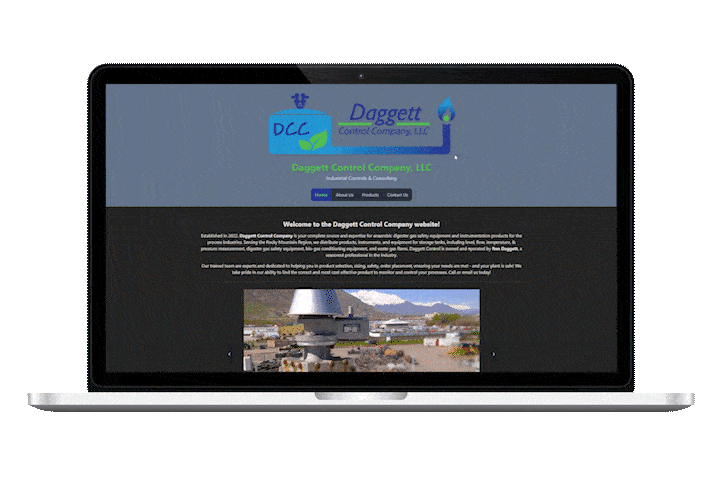

# Daggett Control Company Website

### Developed by [Mike Davis](https://mikedavissoftware.com/)

## Front End:

This is a website create for an industrial control company, Daggett Control Company, LLC.

This website includes four pages:

- Home
- About Us
- Our Services
- Contact Us

---

### During development, start servers like so:

Back End (Ruby on Rails):

`rails s`

Front End (React with Vite.js):

`npm run dev --prefix client`

CSS Compiler (Tailwind):

`cd client`

`npx tailwindcss -i ./src/index.css -o ./dist/output.css --watch`

---

### Technologies Used

#### Front End

- React.JS
- Tailwind CSS
- Daisy UI

#### Back End

- Image Upload with Active Storage, validated with Active Storage Validator
- Custom Contact Form
- Custom ERB files for Rails Views
- JBuilder files for json output

#### Deployment

- Deployed on Render.com
- Used PostgreSQL for databasing
- Environment Variables for secure deployment